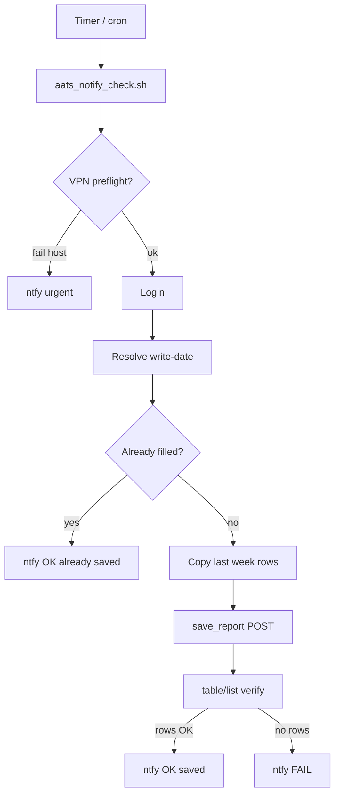

# aats-weekly-report

Automation for **AATS** weekly FAE sumup (`weekly_sumup_fae` on `aats.amlogic.com`).

This repo teaches a script to do what you normally do in the browser: **log in**, **copy last week’s data**, **save**, **check that data really landed**, and **notify your phone** if it worked or failed.

**GitHub:** https://github.com/stulluk/aats-weekly-report

Shared HTTP code lives in `scripts/` (Python 3, stdlib only). Machine-specific setup is under `host-pc/` (laptop + VPN) and `dumpling/` (headless server). See also [`host-pc/README.md`](host-pc/README.md) and [`dumpling/README.md`](dumpling/README.md) for copy-paste install steps.

---

## What problem are we solving?

Every week you must fill the **weekly sumup (FAE)** form in AATS: what you did, issues, plans.

The normal manual flow:

1. Open the browser  
2. Log in  
3. Click **“Copy last week’s data”** (复制上周数据)  
4. Edit a few lines  
5. Click **Save** (保存数据)

We automated that with **Python + HTTP** (no Playwright for the main path) and **ntfy** push notifications. Two machines run the same job so one backup exists if the laptop is asleep or off VPN.

---

## The two machines (Host PC vs Dumpling)

Think of **two alarm clocks in different rooms**. If one room has no power, the other might still ring.

| | **Host PC** (your laptop) | **Dumpling** (build server) |
| --- | --- | --- |
| **Typical host** | Workstation on Forti VPN (`amdpc`, user `stulluk`) | `us-build-dumpling` on company LAN |
| **Network** | Needs **FortiClient VPN** (or internal `AATS_BASE_URL`) to reach AATS from outside | Already on **corporate network** — **no VPN** |
| **Scheduler** | `systemd --user` timer: **Fri / Sat / Sun 11:00** Europe/Istanbul | **`crontab`** (see `dumpling/README.md`) |
| **Notifications** | `https://ntfy.kernelmax.com/aats-weekly-sumup-fae` + optional **desktop** popup | `https://ntfy.sh/aats-weekly-sumup-fae` (kernelmax is often blocked from build networks) |
| **Repo folder** | [`host-pc/`](host-pc/) | [`dumpling/`](dumpling/) (docs; same scripts) |

**Same topic name everywhere:** `aats-weekly-sumup-fae` (only the ntfy **server host** differs).

**Secrets** never go in git. Each machine uses `~/.config/aats-weekly-notify.env` (mode `600`). Template: [`host-pc/systemd/aats-weekly-notify.env.example`](host-pc/systemd/aats-weekly-notify.env.example).

---

## How the automatic job works (simple picture)

The website is like a restaurant. The browser is a person who reads the menu and talks to the waiter. Our scripts are a **robot that places the same orders** the browser would.

**Default path** (`aats_notify_check.sh` → `aats_weekly_copy_save_verify.py`):

```text
Timer fires (Fri/Sat/Sun on host, or cron on dumpling)
    │
    ├─► [Host only] VPN preflight: GET .../weekly_sumup_fae/main
    │       fail → urgent ntfy "AATS unreachable", stop
    │
    ├─► Log in (POST /user/login/ad, same as Email tab)
    │
    ├─► Pick the correct **write-date** (week label — see "Date trap" below)
    │
    ├─► Already has real sumup rows for that date?
    │       yes → ntfy "already saved", done
    │
    ├─► Load **last week** via table/list (write-date − 7 days)
    ├─► Transform rows like the UI "Copy last week" button (no dedicated copy API)
    ├─► POST **save_report** (same as clicking Save)
    │
    └─► Read table/list again — at least one substantive sumup row?
            yes → ntfy "saved and verified"
            no  → ntfy "FAIL — save did not verify"
```

**Critical rule:** **Copy last week does not save.** The UI only fills the form in memory until you click Save. Our automation always does **copy → save → verify**.



---

## What is in this repo?

| Path | Role |
| --- | --- |
| [`scripts/aats_http.py`](scripts/aats_http.py) | Shared HTTP: login, `table/list`, copy transforms, `save_report`, date helpers |
| [`host-pc/scripts/aats_read_weekly_report.py`](host-pc/scripts/aats_read_weekly_report.py) | **Read-only:** print sumup/issue/plan for a date |
| [`host-pc/scripts/aats_check_weekly_filled.py`](host-pc/scripts/aats_check_weekly_filled.py) | **Check only:** substantive rows exist? (exit 0 / 2) |
| [`host-pc/scripts/aats_copy_last_week_data.py`](host-pc/scripts/aats_copy_last_week_data.py) | **Dry-run copy:** same as UI copy button, **no save** |
| [`host-pc/scripts/aats_weekly_copy_save_verify.py`](host-pc/scripts/aats_weekly_copy_save_verify.py) | **Main job:** copy + save + verify (JSON lines on stdout) |
| [`host-pc/scripts/aats_notify_check.sh`](host-pc/scripts/aats_notify_check.sh) | Wrapper: VPN check, runs save-verify, **always ntfy** |
| [`host-pc/systemd/`](host-pc/systemd/) | User timer + service for host PC |
| [`host-pc/scripts/aats_try_append_sumup_notes.py`](host-pc/scripts/aats_try_append_sumup_notes.py) | **Experimental** notes writer (superseded by correct save shape in `aats_http.py`) |

---

## HTTP vs browser

- **Reading** (`table/list`): plain HTTP is enough. Login cookie required; no anonymous read of your draft.
- **Copy last week:** no separate API. The SPA `POST`s `table/list` with `date = write-date − 7 days`, then mutates rows client-side (`id=""`, `treeDisabled`, blank rows per section).
- **Saving:** `POST /weekly_sumup_fae/save_report` with `sumup`, `issue`, `plan` as **JSON strings** plus `remove-*` keys. Payload must match **DOM field names** the Spring controller expects (not raw `table/list` JSON).

Endpoints (relative to `AATS_BASE_URL`):

1. `POST /weekly_sumup_fae/user/login/ad` — `AML_USER` / `AML_PWD` (Email tab; `@amlogic.com` appended if missing)  
2. `GET /weekly_sumup_fae/main` — parse embedded JS for `id`, `departmentid`, optional `write-date`  
3. `POST /weekly_sumup_fae/table/list` — rows for a given report date  
4. `POST /weekly_sumup_fae/save_report` — persist copy result  

---

## Problems we hit and how we fixed them

### 1. Save returned HTTP 500 (`getWorkType()` null)

**What happened:** Sending raw `table/list` JSON to `save_report` crashed the server.

**Why:** The browser sends **form field names**, e.g. `workType.id`, not a nested `workType` object.

**Fix:** Build rows with `build_sumup_row_for_save()` in `aats_http.py`, aligned with a real browser Save request (copy as fetch/curl from DevTools if something still breaks).

### 2. “Copy last week” looked like success but nothing was saved

**What happened:** We only simulated the copy button.

**Why:** Copy only changes in-memory rows until Save.

**Fix:** Always call `save_report`, then **verify** with another `table/list`.

### 3. Server said success but verify showed zero rows

**What happened:** Save appeared OK but data was on the wrong week or empty.

**Fix:** After save, run the same “filled?” logic again. ntfy **OK** only if substantive sumup rows exist (`statement` non-empty or `workTime >= 0.5`).

### 4. The date trap (wrong week label)

**What happened:** On **Friday morning**, using “today’s calendar date” or “last Sunday” pointed at the **wrong week**. Notifications said an old week was “filled” while this week was still empty.

**Why:** AATS uses the **week-ending Sunday** as the `write-date` label for the week you are filing. Mid-week calendar dates are **off-week** and may not persist correctly.

**Fix:** Default target date is `filing_week_label_iso("Europe/Istanbul")` — the **upcoming Sunday** Mon–Sat (e.g. Friday 2026-05-15 → write-date **2026-05-17**). Copy source = that date minus 7 days (`previous_report_date`). Messages also show **calendar today** so you are not confused.

Override with `AATS_REPORT_DATE` or `--date YYYY-MM-DD` when debugging.

On **Python 3.8** (dumpling), `zoneinfo` may be missing; Istanbul falls back to **UTC+3** in `calendar_today_iso()`.

### 5. Host timer failed when Forti was off

**What happened:** DNS errors for `aats.amlogic.com` / `ntfy.kernelmax.com`.

**Fix:** `AATS_VPN_PREFLIGHT=1` on host — quick `curl` to `.../main` before login; urgent ntfy and exit 3. Use internal IP in `AATS_BASE_URL` when VPN is up (e.g. `http://10.18.11.124`). Dumpling sets `AATS_VPN_PREFLIGHT=0`.

### 6. ntfy.kernelmax.com from dumpling

**What happened:** TCP timeout to Oracle-hosted kernelmax from corporate egress.

**Fix:** Dumpling uses **`ntfy.sh`** with the **same topic path** `aats-weekly-sumup-fae`.

### 7. False “all good” from check-only mode

**What happened:** Read-only check saw **old week** rows and reported filled.

**Fix:** Default automation is **copy + save + verify**, not check-only. Legacy check-only: `AATS_SKIP_SAVE=1`.

### Other notes

- Free-text per row (including **Others**) is **`notes`**, not `statement` (main task line).  
- `aats_try_append_sumup_notes.py` is experimental; use the main save path for production.  
- Host `notify-send` under `systemd --user` may need `DISPLAY=:0` in a service drop-in.

| Problem | Symptom | Fix |
| --- | --- | --- |
| Wrong save JSON | HTTP 500 | `workType.id`, DOM field names in `build_sumup_row_for_save` |
| Copy without save | Empty after “success” | Always `save_report` + verify |
| Wrong date | Old week looks filled | `filing_week_label_iso` (upcoming Sunday) |
| VPN off (host) | DNS / connection errors | VPN preflight + internal `AATS_BASE_URL` |
| kernelmax blocked | ntfy timeout from dumpling | `ntfy.sh` |
| Check-only false positive | Wrong OK message | Use default save-verify path |

---

## What you see on your phone (ntfy)

Topic: **`aats-weekly-sumup-fae`**

| Title (roughly) | Meaning |
| --- | --- |
| `AATS OK — saved and verified (DATE)` | Copy, save, and read-back all matched |
| `AATS OK — report DATE already saved` | Real rows were already there; no duplicate save |
| `AATS FAIL — save did not verify (DATE)` | Save ran but substantive rows missing after verify |
| `AATS ERROR (DATE)` | Login or other hard failure |
| `AATS unreachable (VPN / network)` | Host preflight could not reach `.../main` |

Body always includes **calendar today**, **write-date (AATS label)**, and **copy-last-week source date**.

---

## Quick manual test

```bash
cd /path/to/aats-weekly-report
set -a && source ~/.config/aats-weekly-notify.env && set +a

# Full job + ntfy (default)
bash host-pc/scripts/aats_notify_check.sh

# Read-only: what is on the server for a date?
python3 host-pc/scripts/aats_read_weekly_report.py --date 2026-05-17

# Check only (no save)
python3 host-pc/scripts/aats_check_weekly_filled.py

# Copy dry-run (no save)
python3 host-pc/scripts/aats_copy_last_week_data.py

# Copy + save + verify (no ntfy)
python3 host-pc/scripts/aats_weekly_copy_save_verify.py
```

Compare script output with the browser for the **same write-date** field on the weekly form.

---

## Environment variables

| Variable | Meaning |
| --- | --- |
| `REPO_ROOT` | Path to this git checkout (required by shell wrapper) |
| `AML_USER` | Login user (Email tab); `@amlogic.com` appended when missing |
| `AML_PWD` | Password |
| `AATS_BASE_URL` | Origin, default `http://aats.amlogic.com`; host on VPN may use internal IP |
| `NTFY_URL` | Full topic URL, e.g. `https://ntfy.sh/aats-weekly-sumup-fae` |
| `AATS_REPORT_DATE` | Force write-date `YYYY-MM-DD` (optional; default is `filing_week_label_iso`) |
| `AATS_MAX_WEEKS_BACK` | Scan up to N prior weeks for substantive data when target-7 is empty (default `4`) |
| `AATS_VPN_PREFLIGHT` | `1` on host PC: fail fast if AATS main page unreachable |
| `AATS_NOTIFY_DESKTOP` | `1` on host: also `notify-send` |
| `AATS_SKIP_SAVE` | `1`: legacy check-only path (no copy/save) |
| `PYTHONPATH` | Set automatically by shell script to `scripts/` |

Never commit real credentials.

---

## Scheduling

**Host PC** — enable user timer (after env file + symlinks; see [`host-pc/README.md`](host-pc/README.md)):

- **Fri / Sat / Sun 11:00** Europe/Istanbul  
- `loginctl enable-linger` so timer runs when you are logged out  

**Dumpling** — `crontab` entry in [`dumpling/README.md`](dumpling/README.md); same `aats_notify_check.sh`, with `AATS_VPN_PREFLIGHT=0` and `AATS_NOTIFY_DESKTOP=0`.

---

## Repository layout

```text
aats-weekly-report/
├── README.md                 ← you are here (overview + troubleshooting story)
├── scripts/
│   └── aats_http.py          ← shared HTTP + dates + save payloads
├── host-pc/
│   ├── README.md             ← systemd + host install
│   ├── scripts/              ← Python tools + aats_notify_check.sh
│   └── systemd/              ← user timer + service + env example
└── dumpling/
    └── README.md             ← crontab + ntfy.sh notes
```

---

## One-sentence summary

We taught a script to **log in like you**, **copy last week like the button**, **save like Save**, **use the correct Sunday week label**, and **ping your phone** — on **two machines** so one backup exists if the laptop is off VPN or asleep.
